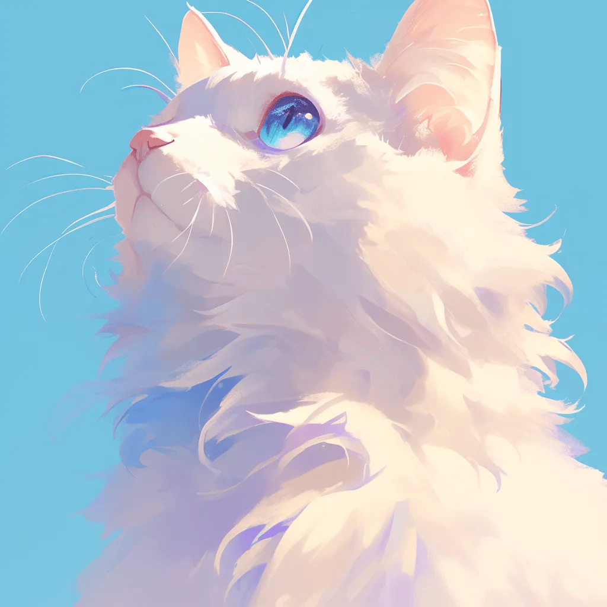

<h1 align="center">
  Hi 👋 I'm Sui 🫧
</h1>

  

<h3 align="center" >
  My Accounte 🔗 
</h3>
 

  
  
 

- システム開発・設計が楽しすぎて毎日寝不足の日々.

- 普段の学習内容はNotionにメモ.

- Notionの溜まった情報を個人ブログにまとめています.

- 個人ブログは下記のリンクから、Notionは上記リンクから内容を確認できます.

- もしよろしければ、GitHub・Xアカウントのフォローをしていただけると記事投稿や学習の励みになります.
  
  

## 個人ブログ
**Dev Wiki** https://oooo-o0.github.io/

<picture>
  <source media="(prefers-color-scheme: dark)" srcset="https://raw.githubusercontent.com/oooo-o0/oooo-o0/output/github-contribution-grid-snake-dark.svg">
  <source media="(prefers-color-scheme: light)" srcset="https://raw.githubusercontent.com/oooo-o0/oooo-o0/output/github-contribution-grid-snake.svg">
  
</picture>

## GitHub Stats

  <picture>
        <source media="(prefers-color-scheme: dark)"  srcset="output/metrics.base.svg" width="400" />
	<source media="(prefers-color-scheme: light)" srcset="output/metrics.base.svg" width="400" />
	
  </picture>
  <picture>
   	<source media="(prefers-color-scheme: dark)"  srcset="output/details.svg" width="400" />
	<source media="(prefers-color-scheme: light)" srcset="output/details.svg" width="400" />
	
  </picture>

	<picture>
	  <source media="(prefers-color-scheme: dark)"  srcset="profile-3d-contrib/profile-night-rainbow.svg" width="700" />
	  <source media="(prefers-color-scheme: light)" srcset="profile-3d-contrib/profile-season-animate.svg" width="700" />
	  
	</picture>

<!--
**oooo-o0/oooo-o0** is a ✨ _special_ ✨ repository because its `README.md` (this file) appears on your GitHub profile.

Here are some ideas to get you started:

- 🔭 I’m currently working on ...
- 🌱 I’m currently learning ...
- 👯 I’m looking to collaborate on ...
- 🤔 I’m looking for help with ...
- 💬 Ask me about ...
- 📫 How to reach me: ...
- 😄 Pronouns: ...
- ⚡ Fun fact: ...
-->

